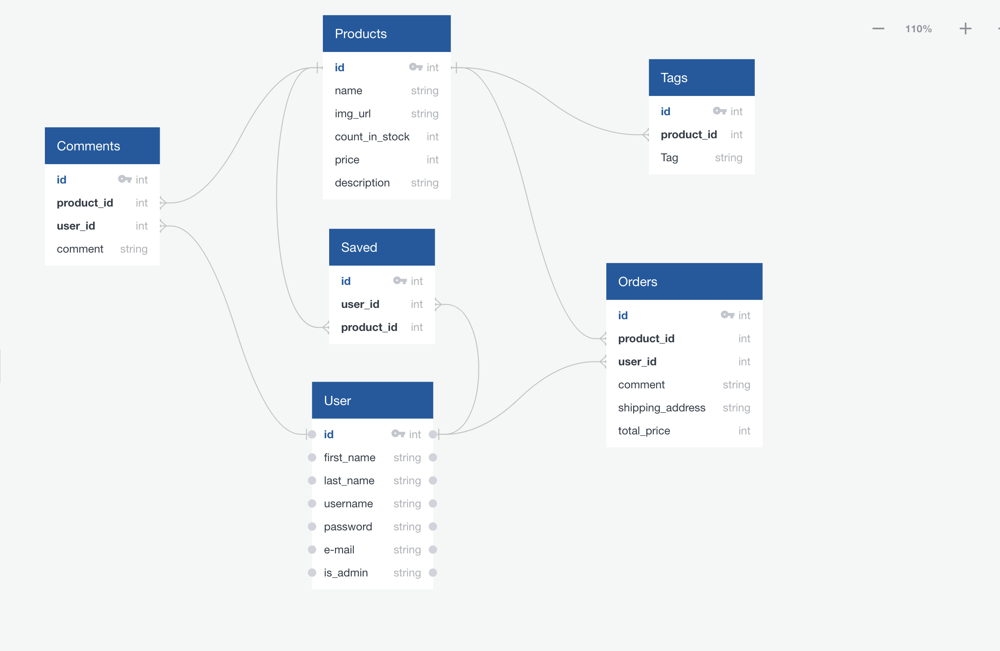

# PetJoy
Pet acessories ecommerce webapp
  
## Overview
  Petjoy will be a full-stack focused e-commerce webapp to sell pet acessories. 
  
  Users will be able to create, update and delete their profile, buy, add comment and rating to products.

  Admin will be able to track users, products and orders. 

## Goals
- Create a real world ecommerce website
- Showcase well documented, thoroughly tested, and soundly engineered code as the final capstone project of the Springboard Software Engineering Course.
- Build a successful business from scratch
  
## User Demographic
Aimed user demographic of this app is mainly anyone with pets.

## Tech Stack and Data Source

This project will be built using React.JS, Node.JS, Express.JS.

## Database Schema

## Sensitive information

Passwords will be encrypted using bcrypt. Minimal user information will be collected.
